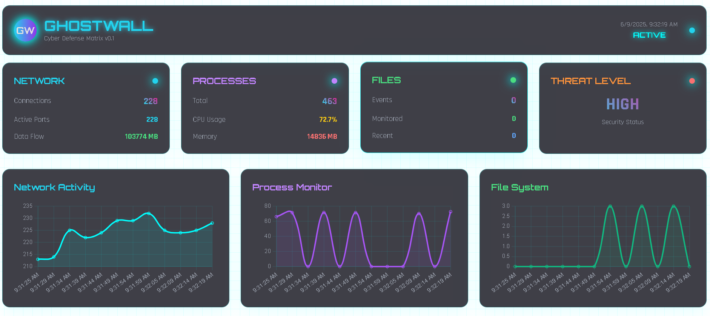

# GhostWall

A lightweight Host-based Intrusion Detection System (HIDS) written in Go that monitors your system for suspicious activities.

Very early development stage, still a lot of bugs.

## Features

- 🔍 Network connection monitoring
- 🧠 Suspicious port and IP detection
- 🗂️ File system monitoring
- ⚠️ Process monitoring
- 📊 Real-time dashboard
- 🔴 Alert system with severity levels
- 🌐 Network session visualization
- ✅ System status monitoring

## Requirements

- Go 1.16 or higher
- Windows 10/11

## License

MIT License 